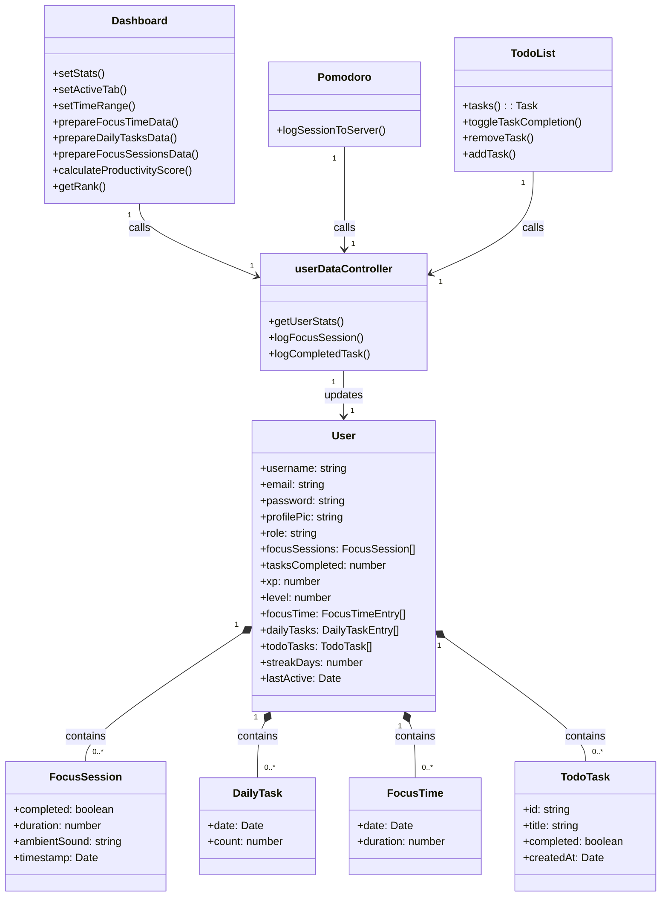

```mermaid
classDiagram
    class Dashboard {
        +setStats()
        +setActiveTab()
        +setTimeRange()
        +prepareFocusTimeData()
        +prepareDailyTasksData()
        +prepareFocusSessionsData()
        +calculateProductivityScore()
        +getRank()
    }

    class Pomodoro {
        +logSessionToServer()
    }

    class TodoList {
        +tasks(): Task
        +toggleTaskCompletion()
        +removeTask()
        +addTask()
    }

    class userDataController {
        +getUserStats()
        +logFocusSession()
        +logCompletedTask()
    }

    class User {
        +username: string
        +email: string
        +password: string
        +profilePic: string
        +role: string
        +focusSessions: FocusSession[]
        +tasksCompleted: number
        +xp: number
        +level: number
        +focusTime: FocusTimeEntry[]
        +dailyTasks: DailyTaskEntry[]
        +todoTasks: TodoTask[]
        +streakDays: number
        +lastActive: Date
    }

    class FocusSession {
        +completed: boolean
        +duration: number
        +ambientSound: string
        +timestamp: Date
    }

    class DailyTask {
        +date: Date
        +count: number
    }

    class FocusTime {
        +date: Date
        +duration: number
    }

    class TodoTask {
        +id: string
        +title: string
        +completed: boolean
        +createdAt: Date
    }

    Dashboard "1" --> "1" userDataController : calls
    Pomodoro "1" --> "1" userDataController : calls
    TodoList "1" --> "1" userDataController : calls
    userDataController "1" --> "1" User : updates
    User "1" *-- "0..*" FocusSession : contains
    User "1" *-- "0..*" DailyTask : contains
    User "1" *-- "0..*" FocusTime : contains
    User "1" *-- "0..*" TodoTask : contains
```
